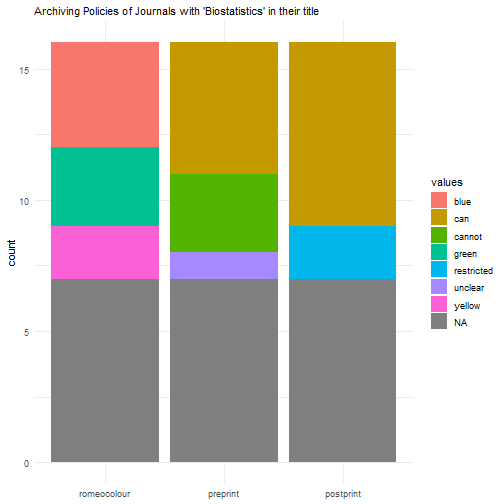

## Query Journal Data

**NOTE:** SHERPA/RoMEO data is released under the [Creative Commons Attribution-NonCommercial-ShareAlike 2.5 (CC BY-NC-SA 2.5) license](https://creativecommons.org/licenses/by-nc-sa/2.5/). A suggestion of citation is included in `rromeo` via `citation("rromeo")`

The SHERPA/RoMEO database contains information on the archival policies of academic journals and publishers. Some journals let you archive a version of a submitted manuscript or book chapter (= preprint) before it's reviewed, some also let you archive the peer-reviewed but not formatted version (= postprint) and some even let you archive the peer-reviewed **and** formatted version of the manuscript (= pdf or publisher's version). The goal of `rromeo` is to make this database accessible through R.

### Query using ISSN

Let's try to access summary data using the ISSN of a journal:


```r
library(rromeo)

rr_journal_issn("1947-6264")
```

```
##                                                       title provided_issn      issn romeocolour preprint
## 1 A Critical Introduction to Media and Communication Theory     1947-6264 1947-6264      yellow      can
##    postprint        pdf pre_embargo post_embargo pdf_embargo
## 1 restricted restricted        <NA>    12 months   12 months
```

From this we see that the archival of the preprint is permitted while some restrictions apply for both postprint and pdf version of the manuscript. The restrictions are visible in the `*_embargo` field: the authors have to wait 12 months after publication before archiving postprint and formatted manuscript.

**Nota Bene**: the `rr_journal_issn()` function can use either the paper edition ISSN of the journal or the ISSN of the electronic version of the journal (e-ISSN or ESSN) which may differ


### Query by Journal Title

We can also search journal by names using `rr_journal_find()` the first argument `name` is the string to look for and the second argument `qtype` defines the way to match. If we want to look at journals that have the word `Biostatistics` in their title we can use the following code:


```r
rr_journal_find("Biostatistics", qtype = "contains")
```

```
## 17 journals match your query terms.
```

```
## Only titles and ISSNs of journals returned. Get more information using `rr_journal_name()`
```

```
##                                                             title provided_issn      issn
## 1                               American Journal of Biostatistics          <NA> 1948-9889
## 2                          Annals of Biometrics and Biostatistics          <NA> 2374-0116
## 4                             Austin Biometrics and Biostatistics          <NA> 2378-9840
## 5                Biometrics & biostatistics international journal          <NA>      <NA>
## 6                                                   Biostatistics          <NA> 1465-4644
## 7                                           Biostatistics -Basel-          <NA> 1527-2486
## 8                Biostatistics, bioinformatics and biomathematics          <NA> 0976-1594
## 9                                Edorium Journal of Biostatistics          <NA>      <NA>
## 10                             Enliven: Biostatistics and Metrics          <NA>      <NA>
## 11                   Epidemiology Biostatistics and Public Health          <NA> 2282-2305
## 12                         International Journal of Biostatistics          <NA> 1557-4679
## 13 International journal of clinical biostatistics and biometrics          <NA>      <NA>
## 14                        Journal of Biometrics and Biostatistics          <NA> 2155-6180
## 15                      Journal of epidemiology and biostatistics          <NA> 1359-5229
## 16                                    JP journal of biostatistics          <NA> 0973-5143
## 17                   Monographs in Epidemiology and Biostatistics          <NA> 0740-0845
```

`rr_journal_find()` will only return the list of titles and ISSN.
You can then use this list to select the exact journal you are looking for (in
this case, it is recommended to use the ISSN).
Alternatively, you may want to get data for all those journals. To achieve this,
you need to use the function `rr_journal_name()` which uses a similar syntax to `rr_journal_find()`:


```r
res <- rr_journal_name("Biostatistics", qtype = "contains")
```

```
## 17 journals match your query terms.
```

```
## Recursively fetching data from each journal. This may take some time...
```

```r
tail(res, 3)
```

```
##                                           title provided_issn      issn romeocolour preprint  postprint
## 14    Journal of epidemiology and biostatistics     1359-5229 1359-5229        <NA>     <NA>       <NA>
## 15                  JP journal of biostatistics     0973-5143 0973-5143        <NA>     <NA>       <NA>
## 16 Monographs in Epidemiology and Biostatistics     0740-0845 0740-0845      yellow      can restricted
##        pdf pre_embargo post_embargo pdf_embargo
## 14    <NA>        <NA>         <NA>        <NA>
## 15    <NA>        <NA>         <NA>        <NA>
## 16 unclear        <NA>    12 months        <NA>
```
The query may run for longer but it gives you all the information on all returned journals.

You can also use other type of name matching with other options for `qtype`, for example when `qtype = "starts"` the query string have to begin the title of the journal:


```r
rr_journal_name("Biostatistics", qtype = "starts")
```

```
## 3 journals match your query terms.
```

```
## Recursively fetching data from each journal. This may take some time...
```

```
##                                              title provided_issn      issn romeocolour preprint
## 1                                    Biostatistics     1465-4644 1465-4644       green      can
## 2                            Biostatistics -Basel-     1527-2486 1527-2486        <NA>     <NA>
## 3 Biostatistics, bioinformatics and biomathematics     0976-1594 0976-1594        <NA>     <NA>
##   postprint    pdf pre_embargo post_embargo pdf_embargo
## 1       can cannot        <NA>         <NA>        <NA>
## 2      <NA>   <NA>        <NA>         <NA>        <NA>
## 3      <NA>   <NA>        <NA>         <NA>        <NA>
```

While using `qtype = exact` the title of the journal should match exactly the used string:


```r
rr_journal_name("Biostatistics", qtype = "exact")
```

```
##           title provided_issn      issn romeocolour preprint postprint    pdf pre_embargo post_embargo
## 1 Biostatistics          <NA> 1465-4644       green      can       can cannot        <NA>         <NA>
##   pdf_embargo
## 1        <NA>
```


## Query Publisher Data

Not only can `rromeo` query journals archival policies but it can do the same for publishers. Indeed the SHERPA/RoMEO database contains much information on publishers' policies, with many ways to retrieve the information.

### Query by Publisher's Name

With `rr_publisher_name()` you can query publishers' information using the name of the publishers. The first argument `name` is the string to match publisher's names the second argument `qtype` gives the type of matching:


```r
rr_publisher_name(name = "Oxford", qtype = "all")
```

```
##   romeoid                                                       publisher alias romeocolour preprint
## 1    2632                                       Oxford Brookes University  <NA>        blue   cannot
## 2    1892                     Oxford Centre for Hebrew and Jewish Studies  <NA>        blue  unclear
## 3     986                       Oxford University Anthropological Society  <NA>       green      can
## 4      55                                         Oxford University Press   OUP      yellow      can
## 5    2072 University of Oxford, Oxford Uehiro Centre for Practical Ethics  <NA>       green      can
##    postprint     pdf
## 1        can     can
## 2        can  cannot
## 3        can     can
## 4 restricted unclear
## 5        can     can
```

When `qtype = "all"` the publishers' names should contain all the words, in any order, included in provided string:

```r
rr_publisher_name(name = "Oxford University", qtype = "all")
```

```
##   romeoid                                                       publisher alias romeocolour preprint
## 1    2632                                       Oxford Brookes University  <NA>        blue   cannot
## 2     986                       Oxford University Anthropological Society  <NA>       green      can
## 3      55                                         Oxford University Press   OUP      yellow      can
## 4    2072 University of Oxford, Oxford Uehiro Centre for Practical Ethics  <NA>       green      can
##    postprint     pdf
## 1        can     can
## 2        can     can
## 3 restricted unclear
## 4        can     can
```

While when `qtype = "exact"` the publishers' names should contain all the words in the same order as provided in the string:

```r
rr_publisher_name(name = "Oxford University", qtype = "exact")
```

```
##   romeoid                                 publisher alias romeocolour preprint  postprint     pdf
## 1     986 Oxford University Anthropological Society  <NA>       green      can        can     can
## 2      55                   Oxford University Press   OUP      yellow      can restricted unclear
```

Finally, when `qtype = "any"` publishers' names can contain any words of the provided string.


### Query by RoMEO's ID

The first column of publishers' policies data frame returned by `rromeo` is named `romeoid` it corresponds to the identifier used by SHERPA/RoMEO to identify publishers in a unique way:


```r
rr_publisher_id(id = 55)
```

```
##   romeoid               publisher alias romeocolour preprint  postprint     pdf
## 1      55 Oxford University Press   OUP      yellow      can restricted unclear
```


### Query by Country or Region

You can also query publishers information based on the country they are in using their two-letters ISO codes (see `?rr_publisher_country` for more information):


```r
rr_publisher_country(country = "IR")
```

```
##    romeoid                                                           publisher                   alias
## 1     1936                              Acta Advances in Agricultural Sciences                    <NA>
## 2     2786                                                   Avicenna Journals Advancements in Science
## 3     1556 Azad University, Mahlkesi Branch, Mechanical Engineering Department                    <NA>
## 4     2741                         Geodynamics Research International Bulletin                    <NA>
## 5     2159       International Journal of Management, Accounting and Economics                    <NA>
## 6     1823                           Islamic Azad University, Najafabad Branch                    <NA>
## 7     1745                            Islamic Azad University, Shahreza Branch                    <NA>
## 8     1726                                                       Islamic Press                    <NA>
## 9     1742                             Jahan Elm Institute of Higher Education                    <NA>
## 10    1414                               Kerman University of Medical Sciences                    <NA>
## 11    1867                                              Oboor Publishing Group                    <NA>
## 12    3078                      Shahid Sadoughi University of Medical Sciences                    <NA>
## 13    2084                                  Shefa Neuroscience Research Center                    <NA>
## 14    1362                                                   Shiraz University                    <NA>
## 15    1753                          Society of Diabetic Nephropathy Prevention                    <NA>
## 16    2922                               Tabriz University of Medical Sciences                    <NA>
## 17    1208                               Tehran University of Medical Sciences                    <NA>
## 18    2845                   University of Maragheh, Department of Mathematics                    <NA>
##    romeocolour preprint  postprint        pdf
## 1         blue   cannot        can        can
## 2        green      can        can        can
## 3         blue   cannot     cannot        can
## 4         blue   cannot     cannot        can
## 5        green      can        can        can
## 6         blue   cannot        can        can
## 7         blue  unclear        can        can
## 8         blue   cannot     cannot        can
## 9         blue  unclear        can        can
## 10        blue   cannot        can        can
## 11       green      can        can        can
## 12      yellow      can restricted restricted
## 13       green      can        can        can
## 14        blue   cannot        can        can
## 15        blue   cannot     cannot        can
## 16        blue   cannot        can        can
## 17       green      can        can        can
## 18       green      can        can        can
```

It is also possible to query publisher's information on a specific region or continent using `rr_publisher_continent()` (see the help page for the list of available regions):


```r
rr_publisher_continent(continent = "Australasia")
```

```
##    romeoid                                                                                publisher
## 1     1514                                                                                ANU Press
## 2     1853                                                                                 ANZAMEMS
## 3      959                                                                               ARRB Group
## 4      736                                                      Association of Occupational Science
## 5      222 Auckland University of Technology, School of Communication Studies, Pacific Media Centre
## 6     2343                                         Australasian Association for Information Systems
## 7     1358                                                             Australasian Medical Journal
## 8      220                     Australasian Society for Computers in Learning in Tertiary Education
## 9       98                                                                Australian Academic Press
## 10     518                                                           Australian Accoustical Society
## 11     638                                               Australian Clearinghouse for Youth Studies
## 12      97                                                          Australian Computer Society Inc
## 13    1813                                                 Australian International Academic Centre
## 14     255                                           Australian Library and Information Association
## 15     248                                                          Australian Mathematical Society
## 16     151                                                     Australian Physiotherapy Association
## 17     161                                                         Australian Psychological Society
## 18     383                                                 Australian Rock Art Research Association
## 19     290                                                      Australian Society of Anaesthetists
## 20    2420                                                                        Bareknuckle Books
## 21     150                          College of Intensive Care Medicine of Australia and New Zealand
## 22     160                                                                         CSIRO Publishing
## 23     553                                                                     e-Content Management
## 24     550                                                                Early Childhood Australia
## 25    2501                                                                   Edith Cowan University
## 26    2453                                                                                     EMAJ
## 27     571                                                       Field Naturalists Club of Victoria
## 28     626                    Griffith University, Griffith Law School, Socio-Legal Research Centre
## 29    1928                                                                           Infinity Press
## 30    1026                                                      Institute of Foresters of Australia
## 31     557                                       International Association for Statistics Education
## 32    3226                                                                     LexisNexis Australia
## 33     163                                                                       Libertas Academica
## 34     745                          Macquarie University, Department of International Communication
## 35     284                                                                           Magnolia Press
## 36    1397                                      Mathematics Education Research Group of Australasia
## 37    1310                                             Melbourne University, Law Review Association
## 38     665                                                                 Monash University ePress
## 39    2471                                                           New Zealand Ecological Society
## 40    2472                                                        New Zealand Institute of Forestry
## 41     598                                                          New Zealand Medical Association
## 42     623                                                          New Zealand Nurses Organisation
## 43     666                                                 New Zealand Society of Animal Production
## 44    2134                                                             Outdoor Council of Australia
## 45     670                                                                            Python Papers
## 46    2755                                                      Queensland University of Technology
## 47    2385                                      Queensland University of Technology, Faculty of Law
## 48     581                                                                          RMIT Publishing
## 49    1767                                       Royal New Zealand College of General Practitioners
## 50     264                                                             Royal Society of New Zealand
## 51    1329                                                                Royal Society of Victoria
## 52    1432                                                                              SETScholars
## 53    3041                                                             Studies in Material Thinking
## 54    3016                                                                        Sydney Law School
## 55     164                                                                          Thomson Reuters
## 56    1946                                                                               UTS ePRESS
## 57    2532                                   Western Australian Institutes for Educational Research
## 58     380                                 World Institute for Engineering and Technology Education
##                                                                           alias romeocolour preprint
## 1                                                                          <NA>       green      can
## 2  Australian and New Zealand Association for Medieval and Early Modern Studies       green      can
## 3                                                                          <NA>        blue   cannot
## 4                                                                          <NA>       white   cannot
## 5                                                                          <NA>        blue   cannot
## 6                                                                          AAIS       green      can
## 7                                                                          <NA>       green      can
## 8                                                                      ascilite       green      can
## 9                                                                          <NA>        blue   cannot
## 10                                                                         <NA>       white   cannot
## 11                                                                         <NA>       green      can
## 12                                                                         <NA>       green      can
## 13                                                                         AIAC       green      can
## 14                                                                         <NA>        blue  unclear
## 15                                                                         <NA>      yellow      can
## 16                                                                         <NA>        blue   cannot
## 17                                                                         <NA>       white  unclear
## 18                                                                         <NA>       white   cannot
## 19                                                                         <NA>       white   cannot
## 20                                                                         <NA>       green      can
## 21                                                                         <NA>       white   cannot
## 22                                                                         <NA>       green      can
## 23                                                                         <NA>       green      can
## 24                                                                         <NA>       white  unclear
## 25                                                                         <NA>        blue   cannot
## 26                                                                         <NA>       green      can
## 27                                                                         <NA>        blue  unclear
## 28                                                                         <NA>        blue   cannot
## 29                                                                         <NA>       green      can
## 30                                                                         <NA>       white   cannot
## 31                                                                         IASE        blue  unclear
## 32                                                                         <NA>        blue  unclear
## 33                                                                         <NA>       green      can
## 34                                                                         <NA>       white  unclear
## 35                                                                         <NA>       white   cannot
## 36                                                                         <NA>        blue  unclear
## 37                                                                         <NA>        blue   cannot
## 38                                                                         <NA>      yellow      can
## 39                                                                         <NA>      yellow      can
## 40                                                                         <NA>      yellow      can
## 41                                                                         <NA>       white   cannot
## 42                                                                         <NA>        blue   cannot
## 43                                                                         <NA>       white  unclear
## 44                                                                         <NA>        blue  unclear
## 45                                                                         <NA>        blue  unclear
## 46                                                                         <NA>       green      can
## 47                                                                         <NA>       green      can
## 48                                                                         <NA>       green      can
## 49                                                                         <NA>        blue   cannot
## 50                                                                         <NA>      yellow      can
## 51                                                                         <NA>       white   cannot
## 52                                                                         <NA>       green      can
## 53                                                                         <NA>        blue  unclear
## 54                                                                         <NA>        blue   cannot
## 55                                                                 Professional        blue   cannot
## 56                                                                         <NA>       green      can
## 57                                                                         <NA>        blue   cannot
## 58                                                                        WIETE       white   cannot
##     postprint        pdf
## 1         can       <NA>
## 2         can        can
## 3         can     cannot
## 4  restricted     cannot
## 5         can        can
## 6         can        can
## 7         can       <NA>
## 8         can        can
## 9         can     cannot
## 10     cannot       <NA>
## 11        can restricted
## 12        can       <NA>
## 13        can        can
## 14        can       <NA>
## 15     cannot restricted
## 16     cannot        can
## 17 restricted     cannot
## 18 restricted       <NA>
## 19 restricted       <NA>
## 20        can        can
## 21     cannot     cannot
## 22        can     cannot
## 23        can     cannot
## 24    unclear       <NA>
## 25        can        can
## 26        can        can
## 27        can        can
## 28        can        can
## 29        can        can
## 30 restricted restricted
## 31        can       <NA>
## 32        can restricted
## 33        can        can
## 34    unclear       <NA>
## 35     cannot     cannot
## 36     cannot        can
## 37        can        can
## 38     cannot       <NA>
## 39 restricted restricted
## 40 restricted restricted
## 41     cannot restricted
## 42     cannot        can
## 43 restricted       <NA>
## 44     cannot        can
## 45        can       <NA>
## 46        can        can
## 47        can        can
## 48        can     cannot
## 49        can        can
## 50 restricted     cannot
## 51     cannot     cannot
## 52        can        can
## 53     cannot        can
## 54     cannot        can
## 55        can       <NA>
## 56        can        can
## 57        can        can
## 58     cannot       <NA>
```

### Query by RoMEO colour

RoMEO assigns a colour depending on the different policies of publishers.

  | RoMEO colour | Archiving policy                                        |
  |:-------------|:--------------------------------------------------------|
  | `green`      | can archive preprint, postprint and publisher's version |
  | `blue`       | can archive postprint **or** publisher's version        |
  | `yellow`     | can archive preprint                                    |
  | `white`      | archiving not formally supported                        |

(Table taken from <http://www.sherpa.ac.uk/romeo/definitions.php#colours>)

You can query journals using this classification with the function `rr_romeo_colour()`:


```r
rr_romeo_colour(romeo_colour = "green")
```

In this example vignette we do not run the query because it can run for quite long as it returns the policies of all publishers of the given colour (you can see the numbers of publishers in each category in the following web page <http://www.sherpa.ac.uk/romeo/statistics.php?la=en&fIDnum=|&mode=simple>).


## Setting up an API key

SHERPA/RoMEO lets you make 500 queries per day per IP address for free. If you get past this limit you will get the following error:
```
You have exceeded the free use limit of 500 requests per day. To go beyond this limit you should register for a free API key available at http://www.sherpa.ac.uk/romeo/apiregistry.php
```
We encourage you to register for a **free** API key at the above-mentioned address.

To provide your API key to `rromeo` you can:
1. provide it as a character string as the `key` arguments of `rromeo` functions as `rr_*(..., key = "my_key_as_a_string")`, we **do not recommend** this method as your API key will be available from your history;
1. you can define the variable `SHERPAROMEO_KEY` in an `.Renviron` file in your working directory, the file should contain the following line
  `SHERPAROMEO_KEY=my_key_without_quotes`;
1. you can also define the variable `SHERPAROMEO_KEY` in an `.Rprofile` file in your working directory, the file should contain the following line
  `SHERPAROMEO_KEY="my_key_with_quotes"`.

## Visualization Example

`rromeo` can be quite useful in bibliometric studies to report on archival policies. For example, we can now have a quick visual overview of the policies of journals in a given field from the results obtained in a query:


```r
library(ggplot2)
theme_set(theme_minimal())

stacked_res <- stack(res[, 4:6])
ggplot(stacked_res, aes(x = ind, fill = values)) +
  geom_bar() +
  labs(x = NULL,
       subtitle = "Archiving Policies of Journals with 'Biostatistics' in their title")
```




```r
ggplot(res, aes(x = "a", fill = romeocolour)) +
  geom_bar() +
  coord_polar("y") +
  labs(x = NULL,
       subtitle = "RoMEO colours of Journals with 'Biostatistics' in their title")
```


